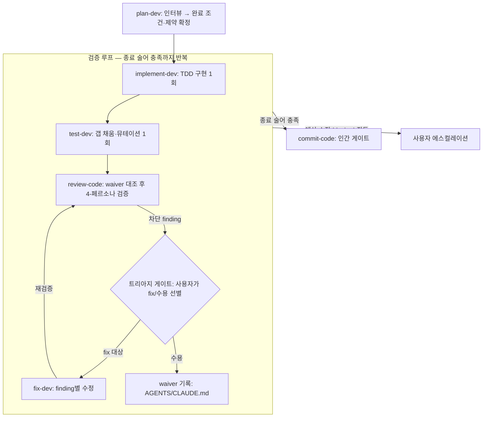

# NEXT_HARNESS_CLAUDE.md — 메타프롬프팅 & 루프 엔지니어링 적용 방향

이 문서는 `feature/next-harness` 브랜치에서 진행할 차기 하네스 개편의 트렌드 조사 결과와 설계 결론을 기록한다. 모든 스킬·에이전트·훅 분석은 Claude 변형(`skills/claude/`, `agents/claude/`, `hooks/claude/`) 기준이며, 조사일은 2026-07-21이다.

## 1. 배경과 목표

- **메타프롬프팅**: `plan-dev`가 만드는 계획 문서와 리서치 문서는 메타프롬프팅의 산출물인 "생성된 프롬프트"와 동일한 역할을 한다. `plan-dev`를 사용자 질의응답을 통해 구현용 프롬프트를 만드는 스킬로 개선하되, 그 산출물이 루프 엔지니어링의 입력이 되므로 **제약과 완료 조건**을 다듬는 데 집중한다.
- **루프 엔지니어링**: `implement-dev → (fix-dev) → test-dev → review-code`로 이어지는 구현 플로우를 루프화한다. 현재는 사용자가 각 스킬을 직접 호출하고 finding을 나르는 수동 파이프라인이다.

## 2. 트렌드 조사 요약

### 2.1 메타프롬프팅

정의: LLM으로 LLM의 프롬프트를 생성·개선하는 기법. 2025~2026년에 두 갈래로 실용화되었다.

- **자동 최적화 계열**: DSPy 옵티마이저 생태계가 메타프롬프팅을 라이브러리 호출로 상품화했다. GEPA(Reflective Prompt Evolution, ICLR 2026 oral)는 실행 궤적을 자연어로 반성해 프롬프트를 진화시키며, RL(GRPO) 대비 평균 +6%p·최대 35배 적은 rollout으로 우수한 성능을 보였다. 핵심 통찰: 스칼라 보상보다 자연어 피드백이 더 풍부한 학습 매체다.
- **대화형 계열(실무 주류)**: "프롬프트를 개선해줘 + 명확화 질문 권한 부여" 패턴. AI가 목표·제약·완료 기준을 질문하고 답변을 반영해 반복 정제한 뒤 승인받는 흐름이 표준이 되었다.
- **코딩 에이전트에서의 실체화 = 스펙 주도 개발(SDD)**: 생성된 프롬프트는 곧 스펙/플랜 문서다. AWS Kiro는 requirements.md(EARS 표기 수용 기준: "WHEN [조건] THE SYSTEM SHALL [행동]") → design.md → tasks.md 3문서 체계, GitHub Spec Kit은 constitution → specify → clarify → plan → tasks 사이클을 제품화했다. 반론(Martin Fowler 블로그, Birgitta Böckeler): 스펙이 비대해지면 리뷰 부담이 코드 리뷰보다 커지고, 에이전트는 긴 스펙을 다 따르지 못하며, 작은 작업에 무거운 워크플로우는 과잉이다.

수렴된 "좋은 생성 프롬프트"의 요건 4가지: ① 검증 가능한(가능하면 실행 가능한) 완료 조건, ② 명시적 제약과 non-goals, ③ 콜드 스타트 에이전트가 재탐색 없이 실행할 수 있는 자족성, ④ 본문은 의도적으로 성긴(coarse) 수준 유지 — 과잉 세부는 해악.

### 2.2 루프 엔지니어링

용어: 2026년 6월 Addy Osmani가 정리해 대중화. Boris Cherny(Claude Code 총괄)의 "나는 더 이상 프롬프트를 치지 않는다. 루프를 쓴다"와 Peter Steinberger의 주장을 종합했다. 발전 사다리: 프롬프트 엔지니어링(보내는 말) → 컨텍스트 엔지니어링(모델이 보는 모든 정보) → 하네스 엔지니어링(에이전트가 도는 환경) → **루프 엔지니어링**(목표를 향해 반복시키는 사이클 설계).

계보와 플랫폼 지원:

- 뿌리는 ReAct와 Anthropic이 정식화한 에이전트 루프: **gather context → take action → verify work → repeat**.
- **Ralph Wiggum 기법**(2025-07, Geoffrey Huntley): `while :; do cat PROMPT.md | claude-code; done`. 매 반복 새 컨텍스트로 시작, 상태는 전부 파일(PROMPT.md·TODO·git)에 저장. Anthropic이 공식 플러그인으로 채택 — Stop hook으로 종료를 가로채 같은 프롬프트를 재주입, `--completion-promise` 문자열 매칭으로 완료 판정, `--max-iterations`가 필수 안전장치.
- Claude Code 네이티브: `/goal`(완료 조건을 **코드를 쓴 모델이 아닌 별도의 빠른 모델이 매 턴 판정** — 생성자/판정자 분리의 제품화), `/loop`(간격 또는 until 조건 반복), `/batch`(5~30개 단위로 분해해 worktree별 병렬 실행).

잘 설계된 루프의 구성요소(Osmani 6요소): ① Automations(일을 스스로 찾는 스케줄 실행), ② Worktrees(병렬 격리), ③ Skills(매 반복 재설명하지 않는 영속 지식), ④ Plugins/MCP(환경에 작용할 수단), ⑤ **Sub-agents 검증(maker-checker 분리, 신뢰 가능한 완료 신호)**, ⑥ State/memory on disk("에이전트는 잊지만 레포는 잊지 않는다").

Anthropic 장기 실행 하네스 패턴: initializer 에이전트가 기능 목록(JSON, pass/fail 필드)과 진행 파일을 만들고, 이후 세션은 "한 번에 한 기능 + 시작 시 기존 기능 회귀 확인 + 컴파일·테스트 그린 상태로 종료(clean state)"를 반복. 결정적 가드레일: **테스트를 지우거나 고치는 것은 용납 불가**(에이전트는 pass 필드만 변경 가능) — reward hacking 방지책.

안티패턴: ① 종료 로직 없는 루프는 자원 싱크, ② 같은 접근의 맹목 재시도, ③ comprehension debt(루프가 빨라질수록 "존재하는 코드"와 "이해하는 코드"의 간극 확대 — 산출물 리뷰는 인간 책임), ④ 완료 판정이 주관적인 작업은 루프 부적합.

## 3. 해석 ①: plan-dev → 메타프롬프팅 스킬

### 3.1 이미 갖춘 것

- Process 3단계(goal/scope 정렬)·5단계(가정 명확화)는 대화형 메타프롬프팅의 인터뷰 단계다.
- 8단계 **Cold hand-off gate**("기억 없는 Worker가 이 플랜+리서치만으로 방향을 복원할 수 있는가")는 자족적 프롬프트 검사 그 자체다.
- `## Non-goals` / `## Key decisions`는 생성 프롬프트의 제약 섹션, TODO별 태그가 달린 강화 리서치 링크는 컨텍스트 라우팅(컨텍스트 엔지니어링 산출물)이다.
- `worker-contract.md`의 dispatch prompt는 프롬프트 템플릿이고 플랜이 그 payload다. 즉 "플랜 문서 = 생성된 프롬프트"는 은유가 아니라 이 하네스의 실제 동작 방식이다.

### 3.2 갭: exit contract 부재

검증 명령은 의도적으로 플랜에 없다(`implement-flow.md`가 Makefile/AGENTS.md에서 추출하도록 규정). 사람이 지켜보는 1회 실행에선 합리적이지만, 루프의 입력이 되려면 **종료 술어가 플랜 안에 고정**되어야 한다. Ralph의 completion-promise, `/goal`의 조건식, Anthropic의 pass/fail 기능 목록, Kiro의 EARS 수용 기준이 모두 같은 요구를 가리킨다.

### 3.3 개선안

1. **`## Completion Criteria` 섹션 신설(enforced)**: (a) 기계 판정 게이트 — 실행 명령 + 기대 결과(Prepare 때 추출하던 검증 명령을 플래닝 시점에 확정해 플랜에 고정), (b) TODO별 수용 기준 1~2줄 — "무엇이 관찰되면 이 TODO는 끝인가"를 GWT/EARS풍으로(행동 관찰 가능해야 하며 코드 형태를 지정하지 않음), (c) 리뷰 게이트 — `review-code` verdict `Correct`(비-waived 차단 finding 0).
2. **`## Budget & Escalation` 섹션 신설**: 최대 루프 사이클 수(기본 3), 동일 결함 재발 시 처리, blocked 시 정지 규칙. 작업 단위 예산은 플랜이 보유해야 루프 컨트롤러가 읽는다.
3. **인터뷰에 "완료 조건 라운드" 추가**: 5단계(가정 명확화) 뒤 `AskUserQuestion`으로 완료 판정 방법과 예산을 명시적으로 합의. 질문의 과녁을 스코프·가정에서 "done의 정의"로 확장한다.
4. **본문은 불변**: 기존 "coarse-grained, outcome-level" 원칙은 SDD의 실패 모드(스펙 비대화)를 정확히 피하고 있어 유지한다. 개선은 경계(입구=리서치 링크, 출구=완료 조건)만 날카롭게 하는 방향이다.

## 4. 해석 ②: 구현 체인 → 검증 루프

### 4.1 이미 갖춘 것

| 루프 엔지니어링 요소 | 하네스 현황 |
| --- | --- |
| Sub-agents 검증 (maker-checker 분리) | ✅ implementer(생성) vs 4 리뷰 페르소나 + test-dev fresh-eyes(검증) vs fix-dev(수정) — Cherny의 "implementer → verifiers → fixer" 오케스트레이터와 동형 |
| 신뢰 가능한 완료 신호 | ✅ 고정 헤딩 Worker 반환: `## Implementation Status: pass\|blocked\|failed`, `## Test Status`, review verdict `Correct/Incorrect` + `[CRITICAL/HIGH]` — 이미 기계 판독 가능한 프로토콜 |
| State/memory on disk | ✅ `docs/agents`의 플랜·리포트, TODO 체크박스 즉시 flip(pause/resume 계약), `## Fix` 누적 이력 |
| Fresh context per iteration | ✅ 모든 Worker가 콜드 서브에이전트(fix-dev는 메인 세션 오염 방지를 존재 이유로 명시) |
| Reward hacking 가드 | ✅ "never weaken tests"가 implement/test/fix 세 스킬에 명문화, test-dev는 프로덕션 코드 수정 금지 |
| Automations / 컨트롤러 | ❌ 사용자가 직접 다음 스킬을 호출하고 finding을 나르는 중 |

루프 문법은 이미 스킬 내부에 존재한다: test-dev Phase 3(efficacy ≥80%까지 반복 → 이후 최대 3회 → 무진전 시 조기 종료), implement-dev·fix-dev의 "같은 에러 3회 시도 후 정지". 없는 것은 스킬들 **사이**의 루프뿐이다.

### 4.2 제안 루프 설계



- **입력**: 완료 술어를 품은 플랜(해석 ①의 산출물) + 리서치 파일.
- **본문**: implement-dev 1회 → test-dev 1회(의심 결함은 finding으로 승격) → review-code → 트리아지 게이트 → fix 대상만 fix-dev로 개별 dispatch → review-code 재실행(2회차부터 수정 검증 중심으로 스코프 축소).
- **성공 종료**: verification 명령 전부 green ∧ review verdict `Correct`(비-waived 차단 finding 0) ∧ 플랜 `Completion Criteria` 충족. 커밋은 루프 밖(commit-code 인간 게이트)에 남긴다.
- **탈출(에스컬레이션)**: ① 사이클 예산 소진(기본 3), ② 진동 감지 — 같은 Location의 finding이 두 사이클 연속 재발, ③ 어떤 Worker든 `blocked`/`Decision Needed`/`needs-confirmation` 반환 시 즉시 정지. 기존 escalation 의미론이 루프의 exit-to-human으로 재해석된다.
- **상태 기록**: IMPL 리포트에 사이클 로그 누적(기존 `## Fix` 누적 패턴의 확장). 상태는 컨텍스트가 아니라 디스크에 둔다.

### 4.3 트리아지 게이트 + waiver 레지스트리

HIGH/CRITICAL finding도 의도된 사항(알고 있으나 제약상 수용하는 위험)일 수 있으므로, 차단 finding을 자동으로 fix-dev에 보내지 않는다. 이 패턴은 Human-in-the-Loop 패턴 + 보안 스캐너의 baseline/suppression(Semgrep ignore, SonarQube won't-fix, `#nosec`) + risk acceptance 레지스트리 + compounding engineering의 codify 단계에 해당한다.

- **흐름**: review-code 집계 후 `AskUserQuestion`으로 각 HIGH/CRITICAL 항목을 "수정" / "수용(known constraint)"으로 선별. 질문당 옵션 4개 제한이 있으므로 finding이 많으면 배치로 나누고, 기본값은 항상 "수정". 수정 항목만 fix-dev로, 수용 항목은 waiver로 기록.
- **기록 위치와 형식**: 대상 레포의 AGENTS.md/CLAUDE.md에 `## Accepted Risks (Review Waivers)` 섹션.

```markdown
## Accepted Risks (Review Waivers)
- **W1** `internal/auth/token.go` — 토큰을 평문 로그에 남김 [원래 HIGH]
  - 사유: 사내 폐쇄망 전용 도구, 로그 수집기가 마스킹 수행. 제약: 로깅 라이브러리 교체 불가(레거시 의존).
  - 결정: 2026-07-21, 사용자. 재검토 조건: 외부 배포 시 / 로깅 라이브러리 교체 시.
```

- **매칭 규칙**: Location ∧ 근본 이슈가 **모두** 일치할 때만 억제 — 파일 단위 blanket 억제로 같은 파일의 새 결함까지 가려지는 것을 방지.
- **강등이지 은폐가 아님**: 매칭된 finding은 verdict 계산에서만 제외하고, 출력의 별도 "Waived" 목록으로 계속 표시(예: "waiver W3 매칭"). 수용한 위험이 매 리뷰마다 보여야 comprehension debt를 피하고 재검토 조건 발동을 알아챌 수 있다.
- **재검토 조건 필수**: 만료 없는 waiver는 제약이 사라진 뒤에도 실제 문제를 영구히 가리는 waiver rot으로 이어진다.
- **기존 배선 활용**: review-code는 이미 Gather context에서 AGENTS/CLAUDE.md를 읽어 dispatch prompt에 전달하므로 추가 배관이 불필요하다. bug bar 7번 규칙("작성자의 의도적 선택이 명백하면 finding 아님")은 리뷰어가 의도를 알 채널이 없어 사실상 사문화되어 있었는데, waiver 레지스트리가 그 채널이 된다.
- **소유권**: 트리아지와 waiver 기록은 루프 컨트롤러가 아니라 **review-code 집계 단계의 확장**으로 둔다. 루프 밖 단독 실행에서도 동일하게 동작하고, 컨트롤러는 그 출력(fix 목록)을 소비만 한다. AGENTS/CLAUDE.md에 에이전트가 기록을 남기는 선례는 learn-from-manual-edits가 이미 갖고 있다.

### 4.4 구현 방식 선택지 (권장 순)

1. **컨트롤러 스킬 신설(가칭 `loop-dev`)** — 권장. 기존 Dispatcher 패턴의 자연스러운 상위 확장. 메인 세션이 이미 고정 헤딩을 파싱하므로 그 결과를 "다음 스킬 결정"에 쓰면 되고, 기존 delegation-failure 게이트·escalation 의미론을 보존하며, 스킬 단위라 Codex/OpenCode 마이그레이션도 용이하다.
2. **네이티브 `/goal` 하이브리드** — 컨트롤러를 돌리면서 바깥에 `/goal`을 거는 방식. 독립 모델의 완료 판정이 장점이나, 다단계 게이트(efficacy·finding 심각도·blocked 분기)를 단일 조건식으로 표현하기 어려워 보조 수단.
3. **Ralph식 Stop hook** — `hooks/claude`에 무인 장시간 실행용으로 추가하는 장기 확장. 야간 배치성 작업이 생기기 전에는 불필요.

구조적 관찰: **multi-steps 플랜은 이미 외곽 루프다** — main plan=기능 목록, step 완료 시 "컴파일+테스트 그린" 불변식=clean state 종료, 체크박스+리포트=진행 파일로, Anthropic 장기 실행 하네스 패턴과 동형이다. 제안 루프는 step 하나의 내부 루프가 된다. 여기에 learn-from-manual-edits·application-research-sync를 루프 종료 후 단계로 연결하면 compounding engineering(Plan→Delegate→Assess→Codify)의 삼중 루프(내부 검증 루프 / step 외곽 루프 / 회차마다 하네스가 좋아지는 학습 루프)가 완성된다.

## 5. 불변식 (설계 원칙)

- **waiver 작성은 인간 전용**: 루프·fix-dev·리뷰어는 스스로 waiver를 추가할 수 없다. 이 권한이 에이전트에 넘어가면 루프는 "고치는 대신 면제"를 배운다 — 테스트 약화와 동일한 reward hacking이므로 "never weaken tests"와 같은 급의 명문 규칙으로 둔다. 무인 모드에서는 트리아지 게이트 도달 시 전부 fix로 취급하거나 정지하며, 자동 수용은 없다.
- **커밋은 루프 밖**: 루프는 "working tree 완성 + 리포트"에서 끝나고, 인간이 리포트를 읽고 commit-code를 호출한다(comprehension debt 대응, 기존 fix-dev no-commit 철학과 일치).
- **테스트 약화 금지 유지**: 기존 세 스킬의 규칙을 루프 전체 불변식으로 승격.
- **플랜 granularity 불변**: 루프화를 이유로 플랜 본문을 세밀화하지 않는다. 강화 대상은 경계(완료 조건·예산)뿐이다.

## 6. 다음 단계

이 설계 전체를 `plan-dev` 멀티스텝으로 플래닝한다. step 후보:

1. `plan-dev` 개선 — `single-step-plan.md`(및 multi-steps 참조)에 `## Completion Criteria` / `## Budget & Escalation` 추가, 인터뷰에 완료 조건 라운드 보강.
2. `review-code` 확장 — 트리아지 게이트(AskUserQuestion) + waiver 레지스트리 기록/대조, verdict 계산을 "비-waived 차단 finding 0"으로 갱신.
3. 루프 컨트롤러 스킬 신설(가칭 `loop-dev`) — 종료 술어 판정, 사이클 예산·진동 감지, 사이클 로그 기록.
4. 반환 계약 보강 — implement-dev/test-dev/review-code 반환에 사이클 문맥(몇 번째 사이클, 이전 finding 목록) 추가.

구현은 `skills/claude/` 기준으로 진행하고, 완료 후 `sync-harness`로 Codex/OpenCode 변형에 전파한다.

## 참고 자료

- [Loop Engineering — Addy Osmani](https://addyosmani.com/blog/loop-engineering/) / [O'Reilly Radar 전재](https://www.oreilly.com/radar/loop-engineering/)
- [What Is Loop Engineering? — MindStudio](https://www.mindstudio.ai/blog/what-is-loop-engineering-ai-coding-agents)
- [Ralph Wiggum 플러그인 README — anthropics/claude-code](https://github.com/anthropics/claude-code/blob/main/plugins/ralph-wiggum/README.md)
- [Effective harnesses for long-running agents — Anthropic](https://www.anthropic.com/engineering/effective-harnesses-for-long-running-agents)
- [Building agents with the Claude Agent SDK — Anthropic](https://claude.com/blog/building-agents-with-the-claude-agent-sdk)
- [/goal 공식 문서 — Claude Code Docs](https://code.claude.com/docs/en/goal)
- [Claude Code 창시자들의 에이전트 루프 설명 — The Neuron](https://www.theneuron.ai/explainer-articles/claude-code-creators-boris-cherny-and-cat-wu-explain-how-to-use-agent-loops/)
- [Meta-Prompting: LLMs Crafting & Enhancing Their Own Prompts — IntuitionLabs](https://intuitionlabs.ai/articles/meta-prompting-llm-self-optimization)
- [GEPA: Reflective Prompt Evolution Can Outperform RL (ICLR 2026)](https://arxiv.org/abs/2507.19457) / [DSPy GEPA 튜토리얼](https://dspy.ai/tutorials/gepa_ai_program/)
- [Understanding Spec-Driven Development: Kiro, spec-kit, Tessl — martinfowler.com](https://martinfowler.com/articles/exploring-gen-ai/sdd-3-tools.html) / [GitHub Spec Kit 문서](https://github.github.com/spec-kit/)
- [Compound Engineering — Every](https://every.to/guides/compound-engineering)
