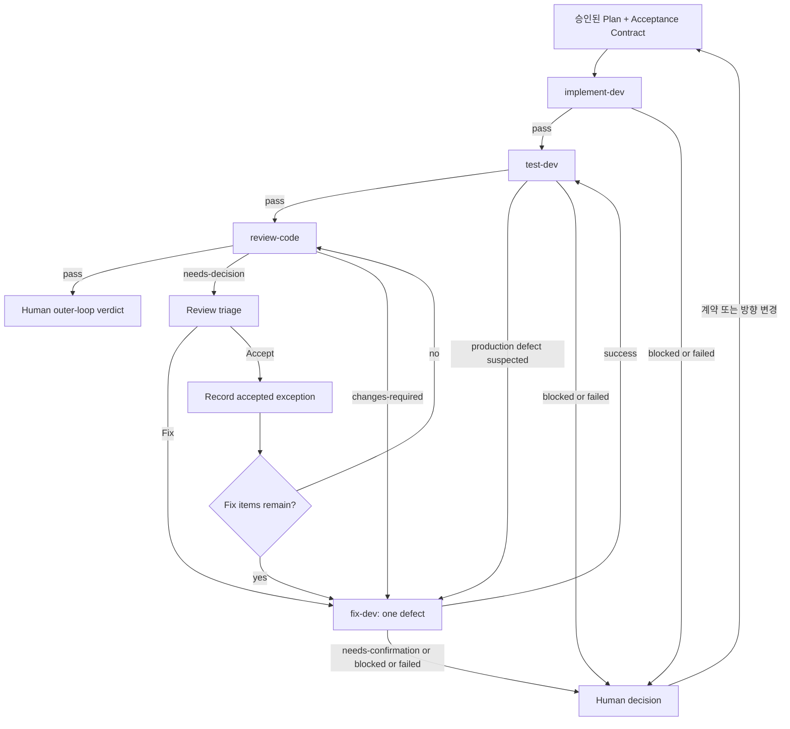

# NEXT HARNESS

- 작성일: 2026-07-21
- 상태: 조사 및 설계 결론
- 기준 플랫폼: Codex
- 범위: `plan-dev`, `implement-dev`, `fix-dev`, `test-dev`, `review-code`, 관련 Codex 에이전트와 훅

## 1. 목적

이 문서는 메타 프롬프팅과 루프 엔지니어링의 최신 흐름을 개인 하네스에 적용하기 위해 수행한 조사와 현재 결론을 정리한다. 목표는 계획 문서를 더 길고 기계적인 지시문으로 만드는 것이 아니라, 사용자의 의도를 구현과 평가가 가능한 실행 계약으로 변환하고 기존 개발 스킬들을 검증 가능한 종료 조건까지 반복 실행하는 구조를 만드는 것이다.

## 2. 핵심 결론

- `plan-dev`는 단순 계획기가 아니라 사용자 의도와 저장소의 실제 상태를 구현 및 평가 가능한 실행 계약으로 컴파일하는 메타 프롬프팅 스킬로 발전시키는 것이 적합하다.
- 계획 문서는 목표·제약·결정·완료 조건을 담는 제어 영역이고, 리서치 문서는 구현자가 TODO별로 필요한 사실을 지연 로딩하는 컨텍스트 영역이다.
- 계획과 리서치를 하나의 거대한 자연어 프롬프트로 합치지 않는다. 계획을 중간 표현으로 사용하고 각 실행 스킬이 필요한 부분만 자신의 Worker 프롬프트로 컴파일한다.
- 현재 `implement-dev → fix-dev → test-dev → review-code` 플로우는 루프에 필요한 generator, optimizer, evaluator를 이미 갖추고 있지만, 다음 단계를 결정하는 컨트롤러와 공통 결과 계약, 영속 상태, 전체 중단 조건이 없어 아직 수동 파이프라인이다.
- 새로운 루프 전용 에이전트보다 기존 스킬 위에서 상태 전이만 담당하는 얇은 Codex 스킬 `dev-loop`가 적합하다.
- HIGH/CRITICAL 리뷰 finding은 자동 수정 대상으로 확정하지 않는다. 먼저 사용자가 항목별로 수정 또는 명시적 위험 수용을 결정하며, 수용된 예외는 적용 범위를 좁게 지정해 `AGENTS.md`와 `CLAUDE.md`에 기록한다.
- 자동 루프는 구현·테스트·리뷰 증거가 모두 충족된 시점에 멈추며, 커밋·푸시·MR 생성은 루프의 권한에 포함하지 않는다.

## 3. 메타 프롬프팅 최신 흐름

현재 메타 프롬프팅은 하나의 단일 기법이 아니라 세 개의 겹치는 흐름으로 이해하는 것이 적절하다.

| 흐름 | 의미 | 하네스에 주는 시사점 |
|---|---|---|
| Prompt-to-prompt | 모델이 실제 작업을 수행할 프롬프트를 생성한다. | `plan-dev`가 구현용 실행 계약을 생성한다는 해석과 연결된다. |
| Task-agnostic scaffolding | 상위 지휘자가 문제를 분해하고 전문 역할에 전달한다. | planner, implementer, tester, reviewer 역할과 컨텍스트를 분리해야 한다. |
| Automatic prompt optimization | 평가 결과와 실행 궤적을 이용해 프롬프트 또는 프롬프트 프로그램을 반복 개선한다. | 루프 실행 결과를 계획 계약과 스킬 프롬프트 개선에 다시 반영할 수 있어야 한다. |

초기의 메타 프롬프팅은 프롬프트를 얻기 위한 프롬프트 또는 작업에 독립적인 상위 지휘 구조에 가까웠다. 이후 자동 프롬프트 최적화는 무엇을 최적화하고, 어떤 평가 기준을 사용하며, 후보를 어떻게 변형하고 탐색할지를 하나의 시스템으로 다루는 방향으로 발전했다. 2026년의 GEPA와 같은 접근은 최종 점수뿐 아니라 실행 궤적과 자연어 피드백을 반영해 프롬프트 후보를 진화시킨다.

최신 모델 사용 지침도 모든 구현 단계를 장황하게 미리 지정하기보다 도메인, 목적, 반드시 지켜야 할 제약, 승인 경계, 관찰 가능한 성공 조건을 명확히 제공하는 쪽을 권한다. 따라서 이 하네스에서 메타 프롬프팅의 목표는 더 긴 계획이 아니라 더 명확하고 평가 가능한 계약이다.

## 4. `plan-dev`의 목표 모델

### 4.1 역할 정의

`plan-dev`의 목표 역할은 다음과 같다.

> 저장소에서 확인한 사실과 사용자와의 질의응답을 바탕으로 사용자 의도를 구현자와 평가자가 독립적으로 사용할 수 있는 실행 계약으로 컴파일한다.

현재 `skills/codex/plan-dev/SKILL.md`는 이미 방향과 구현 세부를 구분하고, 목표·접근법·경계·비목표를 계획에 남기며, 상세한 코드 조사는 리서치 문서로 분리한다. 또한 목표·범위 정렬, 가정 확인, cold handoff 검증, TODO와 리서치의 연결을 수행하므로 기반 구조를 교체할 필요는 없다.

### 4.2 계획과 리서치의 관계

- 계획 문서는 무엇을 달성하고, 무엇을 하지 않으며, 어떤 선택이 승인됐고, 어떤 증거로 완료를 판정할지를 담는다.
- 리서치 문서는 현재 코드 경로, 호출 관계, 인터페이스, 테스트 패턴, 외부 제약 등 구현자가 환경에서 다시 조사하지 않아도 되는 사실을 담는다.
- 계획은 리서치 전체를 복제하지 않고 TODO별 관련 리서치 링크와 요약을 제공한다.
- 실행 스킬은 계획 전체를 무비판적으로 프롬프트에 붙이지 않고 현재 단계에 필요한 계약과 리서치만 읽는다.

### 4.3 계획 문서에 추가할 최소 계약

현재 자유로운 본문 구조와 `Non-goals`, `Key decisions`, `TODOs`를 유지하면서 다음 두 섹션만 안정적인 계약으로 추가하는 것이 적절하다.

```markdown
## Acceptance Contract

| ID | Observable condition | Evidence |
|---|---|---|
| AC-1 | 사용자가 관찰할 수 있는 완료 상태 | 테스트 명령, 산출물 또는 재현 절차 |
| AC-2 | 보존되어야 하는 기존 동작 | 회귀 테스트 또는 비교 결과 |

## Authority Boundaries

- 구현자가 재량으로 결정할 수 있는 사항
- 사용자 확인 없이 변경하면 안 되는 방향
- 외부 변경, 파괴적 작업 또는 범위 확대 시 중단 조건
```

각 TODO는 관련 Acceptance Criteria ID를 참조한다. 저장소의 `Makefile`, `AGENTS.md`, `CLAUDE.md`, `README.md`에서 안정적으로 발견할 수 있는 일반 lint·test·build 명령은 계획에 복제하지 않고 구현 시점에 다시 읽는다. 계획에는 저장소가 자동으로 알려줄 수 없는 작업별 결과와 증거를 기록한다.

### 4.4 질의응답 방식

1. 먼저 저장소에서 확인할 수 있는 사실을 조사한다.
2. 목표, 공개 계약, 아키텍처, 호환성, 오류 동작처럼 결과를 실제로 바꾸는 선택지만 사용자에게 질문한다.
3. 낮은 위험의 구현 세부는 명시된 가정으로 처리하고 구현 단계의 재량으로 남긴다.
4. 계획 초안과 함께 Acceptance Contract를 제시해 사용자가 접근법과 합격 기준을 함께 승인하게 한다.
5. 방향을 바꾸는 미해결 질문이 남아 있으면 계획 승인을 진행하지 않는다.
6. cold handoff gate는 구현자가 방향을 이해할 수 있는지뿐 아니라 독립 평가자가 합격과 실패를 판정할 수 있는지도 확인한다.

### 4.5 planner 에이전트의 경계

`agents/codex/planner.toml`은 아키텍처, 경계, 인터페이스, 전제, 검증 전략과 고영향 모호성 해소에 계속 집중한다. 파일명, frontmatter, TODO 링크, 실행 상태와 같은 워크플로 메커니즘은 planner persona가 아니라 `plan-dev` 스킬이 담당한다.

## 5. 루프 엔지니어링 최신 흐름

Loop Engineering은 비교적 최근에 널리 사용되기 시작한 실무 용어이지만, 그 구성 요소는 evaluator-optimizer, maker-checker, 장기 실행 에이전트 하네스와 같은 기존 패턴에서 이어진다. 핵심은 개별 에이전트가 아니라 에이전트 위의 제어 구조가 다음 행동을 결정한다는 점이다.

루프는 다음 기능을 가져야 한다.

1. 수행해야 할 작업을 찾는다.
2. 적절한 실행자에게 작업을 전달한다.
3. 결과를 독립적으로 검사한다.
4. 다음 실행이 이전 컨텍스트 없이도 이어지도록 상태를 외부에 기록한다.
5. 완료, 수정, 재시도, 사용자 결정 또는 중단 중 하나를 선택한다.

최근 장기 실행 하네스 연구에서는 planner, generator, evaluator 분리, 구조화된 handoff, 독립 평가, 제한된 sprint contract, 토큰·시간·비용을 포함한 중단 조건이 강조된다. 평가 또한 에이전트의 완료 선언이 아니라 실제 최종 상태를 검사해야 하며, 결정적 테스트, 모델 기반 리뷰, 인간 판정을 층별로 결합해야 한다.

Codex의 지속 목표 흐름도 검증 가능한 종료 조건, 증거 명령, 체크포인트와 진행 상태를 요구한다. 어려운 문제를 반복 개선할 때는 한 라운드에서 하나의 집중된 개선을 수행하고, 평가를 다시 실행하며, 결과를 기록하고, 정해진 임계값에서 멈추는 방식이 적합하다.

## 6. 현재 Codex 하네스 진단

| 구성요소 | 루프 역할 | 현재 강점 | 보완할 계약 |
|---|---|---|---|
| `skills/codex/plan-dev` + `agents/codex/planner.toml` | 목표 및 계약 생성 | 사용자 Q&A, 방향 결정, research/TODO 연결 | 관찰 가능한 AC, 증거, 권한 경계 |
| `skills/codex/implement-dev` + `agents/codex/implementer.toml` | Generator | cold Worker, TDD, TODO 상태, 구현 보고서 | AC별 이행 증거와 내부 테스트 정책 일치 |
| `skills/codex/test-dev` | Deterministic evaluator | 독립 컨텍스트, unit/e2e/mutation, 명시적 상태 | 결과의 영속 기록과 AC 연결 |
| `skills/codex/review-code` + 네 reviewer 에이전트 | Semantic evaluator | 보안·신뢰성·유지보수성·일반 품질 분리 | 기계 판독 상태, finding ID, 사용자 위험 수용 게이트 |
| `skills/codex/fix-dev` | Optimizer | 결함 하나씩 수술적으로 수정, 회귀 검증, 확인 필요 상태 | 상위 루프로 돌아가는 명시적 전이 |
| `hooks/codex` | Guard rails | 세션 분류, git identity, `rg`/`fd`, 자동 포맷 | 루프 제어에는 사용하지 않음 |

### 6.1 현재 계약 충돌과 공백

- `plan-dev`는 Codex의 기본 실행을 대화형 메인 세션으로 설명하지만 현재 `implement-dev`는 단일 Worker를 실행하는 Dispatcher를 기본값으로 정의한다.
- `agents/codex/implementer.toml`의 최소 검사 지침과 `implement-dev`의 happy path 및 edge case별 Red-Green-Refactor 규칙 사이에 해석 차이가 있다.
- `review-code`는 `Correct`와 `Incorrect`를 출력하지만 다른 단계처럼 안정적인 상태 블록과 finding ID가 없다.
- `test-dev`와 `review-code` 결과가 주로 대화에 남아 새 세션이나 장기 실행에서 복구하기 어렵다.
- SessionStart 훅은 personal과 work를 구분하지만 single-step 계획의 Jira 메타데이터 요구는 이 구분과 완전히 정렬돼 있지 않다.
- 훅은 정책과 불변 조건을 강제하는 데 적합하지만 단계 전환, 재시도 또는 완료 결정을 담당해서는 안 된다.

## 7. 목표 아키텍처: 얇은 `dev-loop`

`dev-loop`는 생산 코드나 테스트를 직접 수정하지 않고 기존 스킬을 호출하며 상태 전이만 결정하는 Codex 스킬이다. 새로운 persona 에이전트는 추가하지 않는다. 전문 판단은 기존 planner, implementer, test worker, reviewer가 담당하고 오케스트레이션은 스킬에 남긴다.



프로덕션 코드가 수정되면 이전 테스트와 리뷰 증거가 무효화될 수 있으므로 리뷰 finding을 수정한 뒤에도 `test-dev → review-code` 순서로 돌아간다.

## 8. 공통 단계 결과 계약

각 스킬은 기존 상세 보고서와 별개로 컨트롤러가 해석할 수 있는 최소 공통 필드를 반환한다.

```markdown
## Stage Status
pass | blocked | failed | needs-confirmation | needs-decision | changes-required

## Evidence
- 실행한 명령 또는 확인한 산출물
- 관련 Acceptance Criteria ID

## Findings
- FINDING-001: 요약, 심각도, 위치, 현재 상태

## Decision Needed
None 또는 사용자에게 필요한 결정
```

모든 단계가 모든 상태를 사용할 필요는 없다. 각 스킬은 자신에게 적용되는 상태만 사용하되 필드명과 의미는 동일하게 유지한다.

## 9. `review-code`의 사용자 위험 수용 게이트

### 9.1 문제 정의

HIGH 또는 CRITICAL finding이라도 기술적·운영적·외부 시스템 제약 때문에 의도적으로 수용해야 할 수 있다. reviewer는 리뷰 당시 그 의도를 알지 못할 수 있으므로 HIGH/CRITICAL을 발견했다고 즉시 `fix-dev`를 호출하거나 최종 실패로 확정해서는 안 된다.

현재 `review-code`의 bug bar에는 의도된 선택을 버그로 간주하지 않는 기준이 이미 있다. 여기에 사용자가 의도 여부를 사후 확정하는 triage 단계가 필요하다.

### 9.2 리뷰 상태

```markdown
## Review Status
pass | needs-decision | changes-required
```

- `pass`: 해결되지 않은 차단 항목이 없다.
- `needs-decision`: HIGH/CRITICAL이 발견됐지만 사용자가 아직 수정 또는 수용으로 분류하지 않았다.
- `changes-required`: 사용자가 수정 대상으로 분류한 항목이 남아 있다.

### 9.3 사용자 triage

HIGH/CRITICAL을 발견하면 aggregate 단계에서 중복을 제거하고 안정적인 ID를 붙인 뒤 다음 정보를 한 번에 제시한다.

| ID | Severity | Finding | Recommendation | User decision |
|---|---|---|---|---|
| REVIEW-001 | CRITICAL | 구체적인 영향과 위치 | 수정 권장 | Fix / Accept |
| REVIEW-002 | HIGH | 구체적인 영향과 위치 | 제약상 수용 가능 | Fix / Accept |

사용자는 항목별로 `Fix` 또는 `Accept`를 선택한다. reviewer나 `dev-loop`는 사용자의 명시적 응답 없이 위험을 수용했다고 추론하지 않는다.

- `Fix`: `fix-dev`에 한 항목씩 전달하고 수정 후 `test-dev → review-code`를 다시 실행한다.
- `Accept`: 적용 범위를 좁게 지정한 accepted review exception을 `AGENTS.md`와 `CLAUDE.md`에 기록한다.
- Fix와 Accept가 섞여 있으면 예외를 먼저 기록하고 수정 항목을 순차 처리한 뒤 전체 테스트와 리뷰를 다시 실행한다.

### 9.4 accepted review exception 형식

예외는 영향을 받는 코드에 가장 가까운 `AGENTS.md`와 `CLAUDE.md`에 같은 의미로 기록한다. 현재 저장소에는 루트 파일만 있으므로 루트에 기록하지만, 향후 디렉터리별 지침 파일이 있다면 가장 좁은 적용 범위를 우선한다.

```markdown
## Accepted Review Exceptions

### AR-001 — 외부 시스템 제약으로 허용된 평문 전달
- **Applies to**: `internal/legacy/client.go`의 `SendLegacyRequest`
- **Original severity**: HIGH
- **Accepted behavior**: 해당 레거시 엔드포인트에 한해 TLS를 사용하지 않는 동작을 허용한다.
- **Rationale**: 외부 시스템이 TLS를 지원하지 않으며 현재 대체 경로가 없다.
- **Compensating controls**: 사설 네트워크에서만 호출하고 대상 주소를 설정으로 제한한다.
- **Re-open when**: 외부 시스템이 TLS를 지원하거나 호출 경로 또는 네트워크 경계가 변경된다.
- **Approved**: 2026-07-21
```

예외 기록에는 비밀값, 자격 증명, 실제 공격 payload 또는 불필요하게 상세한 악용 절차를 포함하지 않는다.

### 9.5 다음 리뷰에서의 처리

다음 리뷰에서 reviewer는 적용 가능한 `AGENTS.md`와 `CLAUDE.md`의 accepted exception을 입력으로 받는다. finding이 다음 조건을 모두 만족하면 버그 finding으로 다시 출력하지 않는다.

- 기록된 파일, 심볼 또는 동작 범위와 정확히 일치한다.
- 기록된 전제와 보완 통제가 계속 유효하다.
- 위험의 영향이나 적용 범위가 승인 당시보다 확대되지 않았다.
- `Re-open when` 조건이 충족되지 않았다.

다른 파일에서 같은 문제가 발생했거나, 영향이 확대됐거나, 보완 통제가 제거됐거나, 재검토 조건이 충족됐다면 새로운 finding으로 검출한다. 특정 위험의 수용이 동일 유형 전체에 대한 면책으로 확장되어서는 안 된다.

재질문하지 않고도 추적 가능성을 유지하기 위해 최종 리뷰 결과에는 다음처럼 적용된 예외 ID만 짧게 남길 수 있다.

```markdown
## Applied Exceptions
- AR-001: 기존 승인 범위와 정확히 일치하여 finding에서 제외함.
```

## 10. 영속 루프 상태

계획 체크박스와 구현 보고서만으로는 테스트와 리뷰 라운드를 복원하기 어렵다. `docs/agents/dev` 아래에 한 개의 작은 append-only 루프 보고서를 두고 다음 정보만 기록한다.

- plan 및 implementation report 경로
- 현재 단계와 라운드 번호
- 각 단계의 상태
- Acceptance Criteria별 증거
- 열린 finding ID와 사용자 분류
- 적용된 accepted exception ID
- 이미 시도한 수정과 결과
- 다음 실행 단계
- 중단 또는 사용자 결정 사유

원시 대화, 전체 diff, 테스트 원문 또는 서브에이전트 전체 출력을 복제하지 않는다. 상태 파일은 컨텍스트 초기화 이후 재개를 위한 체크포인트이지 두 번째 구현 보고서가 아니다.

## 11. 완료 조건

자동 루프는 다음을 모두 만족할 때만 완료된다.

1. 모든 계획 TODO가 완료됐다.
2. 모든 Acceptance Criteria에 검증 증거가 연결됐다.
3. `implement-dev`가 `pass`이고 구현 보고서가 저장됐다.
4. 적용 가능한 lint, unit, e2e, build 검증이 통과했다.
5. `test-dev`가 `pass`이며 의심되는 프로덕션 결함이 없다.
6. mutation testing이 적용된다면 현재 정책의 임계값을 충족하거나 실행 불가 사유가 명시적으로 승인됐다.
7. 사용자가 수정 대상으로 분류한 HIGH/CRITICAL finding이 남아 있지 않다.
8. 아직 분류되지 않은 HIGH/CRITICAL finding이 없다.
9. 수용된 HIGH/CRITICAL은 범위가 명확한 accepted exception으로 기록됐다.
10. 해결되지 않은 `Decision Needed` 또는 `needs-confirmation`이 없다.
11. 루프 상태 파일에 최종 단계와 증거가 기록됐다.
12. 루프는 여기서 멈추며 커밋, 푸시, PR/MR 생성은 별도의 사용자 요청으로 수행한다.

`NORMAL`과 `LOW`는 사용자에게 공개하되 기본 완료 판정을 차단하지 않는다. 이 항목들까지 자동 수정하면 루프 비용과 변경 범위가 불필요하게 팽창할 수 있다.

## 12. 재시도 및 중단 조건

- 동일 오류에 대한 각 스킬의 기존 3회 제한을 유지한다.
- 전체 remediation round는 초기 MVP에서 최대 3회로 제한한다.
- 같은 차단 finding이 2라운드 연속 남거나 차단 finding 수가 줄지 않으면 no-progress로 중단하고 사용자에게 관찰 결과를 보고한다.
- `test-dev`의 `pass-with-suspected-defects`는 리뷰로 진행하지 않고 의심되는 결함을 사용자에게 알린 뒤 `fix-dev` 대상으로 분류한다.
- 계획의 목표, 접근법, key decision, non-goal, 공개 인터페이스, 데이터 모델 또는 권한 경계를 바꿔야 하면 즉시 중단하고 `plan-dev`로 돌아간다.
- 외부 변경, 파괴적 작업, 권한 확대 또는 비용이 큰 작업이 새로 필요해지면 Authority Boundaries에 따라 사용자 승인을 요청한다.
- `review-code`의 HIGH/CRITICAL은 사용자 triage 없이 자동 수정하거나 자동 수용하지 않는다.

## 13. 에이전트와 훅의 역할 경계

### 13.1 에이전트

- `planner`: 방향, 경계, 인터페이스, 전제, 위험, 검증 전략을 분석한다.
- `implementer`: 승인된 계획과 리서치를 바탕으로 TDD 구현과 보고서 작성을 수행한다.
- `security-reviewer`: 인증·인가, 비밀, 입력 신뢰 경계, 암호화, TOCTOU 등 보안 finding만 담당한다.
- `reliability-reviewer`: 오류 처리, 생명주기, 동시성, 재시도, 타임아웃, 취소 등 신뢰성 finding만 담당한다.
- `maintainability-reviewer`: 로컬 패턴 적합성, 이름, 경계, 테스트 가능성, dead code 등 유지보수성 finding만 담당한다.
- `senior-generalist-reviewer`: 성능, 호환성, UX, 운영 안전성 등 다른 세 축에 속하지 않는 구체적 finding을 담당한다.
- 어떤 에이전트도 전체 루프 상태를 소유하거나 사용자 대신 위험을 수용하지 않는다.

### 13.2 훅

- SessionStart 훅은 저장소를 personal 또는 work로 분류하고 해당 세션 컨텍스트를 제공한다.
- PreToolUse 훅은 git identity와 `rg`·`fd` 사용 규칙을 강제한다.
- PostToolUse 훅은 저장소 포맷 규칙을 적용한다.
- 훅은 단계 실행, finding 수정, 재시도, 완료 판정 또는 accepted exception 생성을 수행하지 않는다.
- 자동 포맷처럼 훅이 작업 트리를 변경할 수 있는 경우 `dev-loop`는 해당 변경과 실패를 다음 검증의 입력으로 관찰한다.

## 14. 점진적 적용 순서

1. `plan-dev`에 Acceptance Contract와 Authority Boundaries를 추가한다.
2. cold handoff gate를 구현 가능성뿐 아니라 독립 평가 가능성까지 확장한다.
3. `plan-dev`, `implement-dev`, `implementer` 사이의 기본 실행 및 테스트 계약 충돌을 정리한다.
4. `test-dev`, `fix-dev`, `review-code`의 단계 결과 필드와 상태 의미를 정렬한다.
5. `review-code`에 안정적인 finding ID, `needs-decision`, 사용자 Fix/Accept triage, accepted exception 처리를 추가한다.
6. 단일 단계 계획만 지원하는 얇은 `dev-loop` MVP와 영속 상태 파일을 추가한다.
7. 작은 실제 작업들로 성공률, 평균 라운드 수, 토큰·시간 비용, 잘못된 자동 수정, 사용자 개입 지점을 측정한다.
8. 측정 결과를 바탕으로 프롬프트와 종료 조건을 한 번에 하나씩 개선한다.
9. 단일 단계 루프가 안정화된 후에만 multi-step 계획과 장기 지속 목표로 확장한다.

## 15. 초기 범위에서 제외할 사항

- 계획을 코드 수준의 기계적 구현 절차로 확장하지 않는다.
- 계획과 모든 리서치를 하나의 거대한 Worker 프롬프트로 합치지 않는다.
- 기존 개발 스킬을 하나의 거대한 스킬로 병합하지 않는다.
- 새로운 loop-controller persona 에이전트를 만들지 않는다.
- 훅으로 루프 오케스트레이션을 구현하지 않는다.
- `NORMAL`과 `LOW` finding을 기본 자동 수정 대상으로 삼지 않는다.
- HIGH/CRITICAL을 사용자 확인 없이 자동 수정하거나 자동 수용하지 않는다.
- 단일 단계 MVP가 검증되기 전에 multi-step, 스케줄링, 병렬 구현 또는 무제한 반복을 추가하지 않는다.
- 루프에 커밋, 푸시, 배포 또는 PR/MR 생성 권한을 포함하지 않는다.

## 16. 조사 자료

- [On Meta-Prompting](https://arxiv.org/abs/2312.06562)
- [Meta-Prompting: Enhancing Language Models with Task-Agnostic Scaffolding](https://arxiv.org/abs/2401.12954)
- [Automatic Prompt Optimization Survey, ACL Findings 2025](https://aclanthology.org/2025.findings-acl.1140.pdf)
- [GEPA, ICLR 2026](https://iclr.cc/virtual/2026/poster/10009493)
- [DSPy Optimizers](https://github.com/stanfordnlp/dspy/blob/main/docs/docs/learn/optimization/optimizers.md)
- [OpenAI Latest Model Guide](https://developers.openai.com/api/docs/guides/latest-model)
- [Loop Engineering](https://addyosmani.com/blog/loop-engineering/)
- [Own the Outer Loop](https://addyo.substack.com/p/own-the-outer-loop)
- [Anthropic: Building Effective Agents](https://www.anthropic.com/engineering/building-effective-agents)
- [Anthropic: Harness Design for Long-Running Application Development](https://www.anthropic.com/engineering/harness-design-long-running-apps)
- [Anthropic: Demystifying Evals for AI Agents](https://www.anthropic.com/engineering/demystifying-evals-for-ai-agents)
- [Codex: Follow a Goal](https://learn.chatgpt.com/use-cases/follow-goals)
- [Codex: Iterate on Difficult Problems](https://learn.chatgpt.com/use-cases/iterate-on-difficult-problems)
