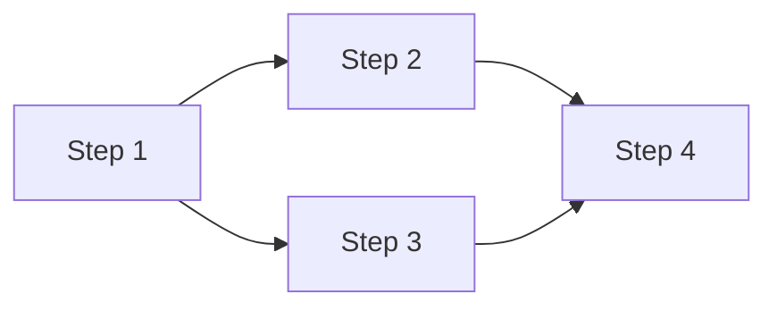

# Multi-steps plan files

A multi-steps plan is one **main plan file** plus one or more **sub-plan files**, each describing a single incremental step. The sub-plans are linked from the main plan via Markdown links. Use this format when `plan-dev` is operating in **multi-steps** mode (user explicitly requested a multi-step breakdown).

## Core principle

Each step is a complete "develop -> test -> build" cycle. After finishing step N, the project compiles and all tests pass. This is non-negotiable because it enables incremental development where confidence grows with each step, and any collaborator (human or AI agent) can pick up from the last completed step.

## What is enforced vs. flexible

**Enforced** (structural metadata, not content):

- File name pattern (section 1)
- Storage location (section 2)
- Markdown link conventions (section 3)
- Frontmatter fields for both main and sub-plans (sections 4 and 5)
- Body language: Korean

**Flexible**:

- Section structure inside the bodies of the main plan and sub-plans. Sections 4 and 5 below show a suggested default. Drop sections that do not apply, add ones that do, reorder freely. The cross-checks in section 7 still need to be satisfiable, but how you arrange the body is your call.

## 1. File names

Main plan: `{timestamp}_{Jira}_PLAN_{title}.md`

Sub-plans: `{timestamp}_{Jira}_PLAN_{title}-STEP-{N}.md` where `N` starts at 1.

- The `{timestamp}`, `{Jira}`, and `{title}` components follow the same rules as in [single-step-plan.md](single-step-plan.md).
- Sub-plan base names share the main plan's base; only the `-STEP-N` suffix differs.
- Example: main `20260622153045_PROJ-42_PLAN_introduce-event-bus.md`, sub `20260622153045_PROJ-42_PLAN_introduce-event-bus-STEP-1.md`.

## 2. Storage location

Always store all plan files (main + sub-plans) in `docs/agents/dev/` under the project root. Create the directory if it does not exist.

## 3. Markdown link conventions

- The main plan links to each sub-plan using Markdown links, e.g. `[Step 1](./20260622153045_PROJ-42_PLAN_introduce-event-bus-STEP-1.md)`.
- Each sub-plan links back to the main plan in its header area, e.g. `Part of main plan: [20260622153045_PROJ-42_PLAN_introduce-event-bus.md](./20260622153045_PROJ-42_PLAN_introduce-event-bus.md)`.
- Research links point from `docs/agents/dev/` to `docs/agents/research/`, e.g. `[auth-flow](../research/auth-flow.md)`.

## 4. Main plan

### Required frontmatter

```yaml
---
Application: {Application}
JiraTicket: {Jira ticket number}
PlanType: multi-steps
Timestamp: {timestamp}
Title: {title}
---
```

### Suggested body structure

Adapt freely. For a small initiative you might skip "Architecture Overview" and "Tech Stack" if everything is already covered in `CLAUDE.md` / `AGENTS.md`. For a SPEC.md-driven new project, "Requirements Coverage" is essential. The Mermaid DAG is optional but pays off when steps have non-trivial dependencies.

```markdown
---
Application: {Application}
JiraTicket: {Jira ticket number}
PlanType: multi-steps
Timestamp: {timestamp}
Title: {title}
---

# [Project / Initiative Name]

Main plan. Sub-plans:
- [Step 1](./{timestamp}_{Jira}_PLAN_{title}-STEP-1.md)
- [Step 2](./{timestamp}_{Jira}_PLAN_{title}-STEP-2.md)

Related research:
- [Research title](../research/research-title.md)

## Goal
One-paragraph summary of what we're building and why.

## Architecture Overview
High-level architecture: key components, their relationships, and technology choices. When SPEC.md is the source, derive from its Architecture section (Context, Runtime, Code/Module).

## Tech Stack
Languages, frameworks, and key dependencies. When SPEC.md is the source, carry over from its Tech Stack section.

## Conventions
Project-wide conventions that apply across all steps: error handling, logging, API response format, auth approach, etc.

## Requirements Coverage
Include this section ONLY when SPEC.md with numbered Functional Requirements (FR-N) is an input. Map each FR-N to the step(s) that implement it.

| Requirement | Description | Implemented In |
|-------------|-------------|----------------|
| FR-1 | {name} | Step 2, Step 3 |
| FR-2 | {name} | Step 4 |

## Steps Overview

| Step | Title | Description | Depends On |
|------|-------|-------------|------------|
| 1 | {title} | {one-line summary} | None |
| 2 | {title} | {one-line summary} | Step 1 |
| 3 | {title} | {one-line summary} | Step 1 |
| 4 | {title} | {one-line summary} | Step 2, Step 3 |

## Execution Flow

Phase 1: [Step 1]
Phase 2: [Step 2, Step 3] - parallel (both depend only on Step 1)
Phase 3: [Step 4] - depends on Steps 2 and 3



## Sub-plans
- [Step 1](./{timestamp}_{Jira}_PLAN_{title}-STEP-1.md) - {title}
- [Step 2](./{timestamp}_{Jira}_PLAN_{title}-STEP-2.md) - {title}
```

## 5. Sub-plan (`-STEP-N.md`)

### Required frontmatter

```yaml
---
Application: {Application}
JiraTicket: {Jira ticket number}
PlanType: multi-steps-sub
Timestamp: {timestamp}
Title: {title}
Step: {N}
---
```

### Suggested body structure

Each sub-plan should leave a future executor (human or agent) with enough context to start without re-investigating. The shape below is a starting point; collapse, expand, reorder as needed.

```markdown
---
Application: {Application}
JiraTicket: {Jira ticket number}
PlanType: multi-steps-sub
Timestamp: {timestamp}
Title: {title}
Step: {N}
---

# Step {N}: {Title}

Part of main plan: [{timestamp}_{Jira}_PLAN_{title}.md](./{timestamp}_{Jira}_PLAN_{title}.md)

## Goal
What this step achieves and why it matters in the overall plan.

## Implements
Which Functional Requirements (FR-N) from SPEC.md this step covers, fully or partially. Omit if SPEC.md is not an input or this step implements no specific FR (e.g., project scaffold).
- FR-1: {brief description of what aspect is implemented in this step}
- FR-3: {brief description} (partial - remaining in Step 5)

## Depends On
List prior steps that must be completed first (or "None" for the first step).

## Tasks
Checkbox list of concrete tasks. Each task specifies what to do, which file(s), key implementation details, and applicable conventions.

- [ ] Task 1 - {what} in `path/to/file` ({key detail or convention})
- [ ] Task 2 - ...

## Affected Files
| Action | Path | Description |
|--------|------|-------------|
| Create | `path/to/file` | Brief purpose |
| Modify | `path/to/existing` | What changes and why |

## Tests
- What to test (unit / integration)
- Which test files to create
- Key test scenarios derived from FR Input/Output and Business rules where applicable
- Edge cases to cover

## Build Verification
Commands to confirm this step is complete:

```bash
# Adapt to the project's tech stack:
# Go:    go build ./... && go test ./... && go vet ./...
# Node:  npm run build && npm test && npm run lint
# Rust:  cargo build && cargo test && cargo clippy
```

## Completion Checklist
- [ ] All tasks completed
- [ ] All tests written and passing
- [ ] Build verification passes
- [ ] No regressions from previous steps
- [ ] Conventions followed
```

The `## Tasks` checkbox list pairs well with `implement-dev`, which ticks each box as it completes a task. If you keep that pattern, the items should be concrete enough that another agent can execute them without re-investigating the codebase.

## 6. Step decomposition guidance

- **FR-driven decomposition** (when SPEC.md is input): each FR-N already has Input, Output, Business rules, Edge cases; these map directly to a step's tasks and test scenarios. Group related FRs into a single step when they share dependencies; split a large FR across multiple steps when it is too big.
- **Incrementality**: each step must leave the project compiling and tests passing. Foundation first, then dependent behavior.
- **Right-sized steps**: a good step takes 1-4 hours of focused work. If a step has more than about 10 tasks, consider splitting.
- **Test-first thinking**: if you cannot define clear tests for a step, the step's scope is probably wrong.
- **Common first step**: project scaffold: module/package init, directory structure, linting/formatting config, CI setup, convention infrastructure (error types, logger setup, response helpers).

Adapt the breakdown to the project's nature. TUI, backend service, CLI, library, and full-stack apps each have different natural decomposition patterns. Do not force a one-size-fits-all structure.

## 7. Cross-checks

Before finalizing (still inside plan mode, in the Review step):

- "If I completed only steps 1 through N, does the project compile and do all tests pass?" If not, restructure.
- "Does every FR-N (when SPEC.md is an input) appear in at least one step?" If not, add the missing coverage.
- "Do the main plan's Markdown links match the sub-plan filenames I will write?" Verify each link before passing the plan to `ExitPlanMode`. After writing the files in the persistence step, double-check that every link resolves.
