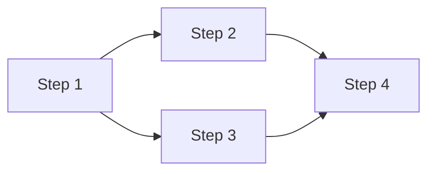

# Multi-steps plan files

A multi-steps plan is a set of **standalone single-step plans** organized by one **main plan** (the parent). Each sub-plan is a complete [single-step plan](single-step-plan.md) in its own right - same frontmatter, same free-form body, same research links, same `## TODOs`, same granularity rules - and is executed **individually** by `implement-dev` in single-step mode. The main plan adds nothing to any step's implementation; its only job is to **organize the relationship between the sub-plans**: their order, dependencies, shared conventions, and how they compose into the whole.

Use this format when `plan-dev` is operating in **multi-steps** mode (user explicitly requested a multi-step breakdown), typically for new projects or large initiatives delivered as incremental build-test cycles.

## Core principle

Each step is a complete "develop -> test -> build" cycle. After finishing step N, the project compiles and all tests pass. This is non-negotiable: it is what lets each sub-plan be planned, implemented, and reviewed on its own, and lets any collaborator (human or agent) pick up from the last completed step.

## Execution model

- Each sub-plan is run by `implement-dev` **individually, as a single-step plan**, in the dependency order the main plan lays out.
- The **main plan is not implemented directly** - it is the map, not a step. Point `implement-dev` at a sub-plan, not at the main plan.
- Because steps are planned together but implemented in separate runs, whatever seam one step exposes to later steps must live in the plan artifacts (see "Explicit step contracts" in section 6), not in a shared session.

## What is enforced vs. flexible

**Enforced** (structural metadata, not content):

- File name pattern (section 1)
- Storage location (section 2)
- Markdown link conventions (section 3)
- Frontmatter fields for both main and sub-plans (sections 4 and 5)
- Body language: Korean
- Each sub-plan inherits single-step enforcement: strengthened research links with per-TODO tags, `## TODOs` with `(→ research: …)` hints when applicable, and `## Non-goals` / `## Key decisions` anchors **required when the sub-plan is non-trivial** (the same cold-handoff rationale as single-step - the Worker running this sub-plan has no memory of the planning session)

**Flexible**:

- Section structure inside the bodies of the main plan and sub-plans. Sections 4 and 5 below show a suggested default. Drop sections that do not apply, add ones that do, reorder freely. The cross-checks in section 7 still need to be satisfiable, but how you arrange the body is your call.

Plan granularity (see SKILL.md) applies to each sub-plan exactly as it does to any single-step plan: keep step-internal mechanics coarse and defer them to `implement-dev`. The one place multi-steps demands extra precision is the **contract between steps** - what one step exposes to the next - because each sub-plan is planned and implemented separately (section 6).

## 1. File names

Main plan: `{timestamp}_{Jira}_PLAN_{title}.md`

Sub-plans: `{timestamp}_{Jira}_PLAN_{title}-STEP-{N}.md` where `N` starts at 1.

- The `{timestamp}`, `{Jira}`, and `{title}` components follow the same rules as in [single-step-plan.md](single-step-plan.md).
- Sub-plan base names share the main plan's base; only the `-STEP-N` suffix differs.
- Example: main `20260622153045_PROJ-42_PLAN_introduce-event-bus.md`, sub `20260622153045_PROJ-42_PLAN_introduce-event-bus-STEP-1.md`.

## 2. Storage location

Always store all plan files (main + sub-plans) in `docs/agents/dev/` under the project root. Create the directory if it does not exist.

## 3. Markdown link conventions

- The main plan links to each sub-plan using Markdown links, e.g. `[Step 1](./20260622153045_PROJ-42_PLAN_introduce-event-bus-STEP-1.md)`.
- Each sub-plan links back to the main plan in its header area, e.g. `Part of main plan: [20260622153045_PROJ-42_PLAN_introduce-event-bus.md](./20260622153045_PROJ-42_PLAN_introduce-event-bus.md)`.
- Research links point from `docs/agents/dev/` to `docs/agents/research/`, e.g. `[auth-flow](../research/auth-flow.md)`.

## 4. Main plan

### Required frontmatter

```yaml
---
Application: {Application}
JiraTicket: {Jira ticket number}
PlanType: multi-steps
Timestamp: {timestamp}
Title: {title}
---
```

### Suggested body structure

Adapt freely. For a small initiative you might skip "Architecture Overview" and "Tech Stack" if everything is already covered in `CLAUDE.md` / `AGENTS.md`. For a SPEC.md-driven new project, "Requirements Coverage" is essential. The Mermaid DAG is optional but pays off when steps have non-trivial dependencies.

```markdown
---
Application: {Application}
JiraTicket: {Jira ticket number}
PlanType: multi-steps
Timestamp: {timestamp}
Title: {title}
---

# [Project / Initiative Name]

Main plan. Sub-plans:
- [Step 1](./{timestamp}_{Jira}_PLAN_{title}-STEP-1.md)
- [Step 2](./{timestamp}_{Jira}_PLAN_{title}-STEP-2.md)

Related research (optional; the Worker reads research from each sub-plan, not here - keep entries short summaries):
- [Research title](../research/research-title.md) — {한 줄 요약: 이 리서치가 담은 현재-코드 이해}

## Goal
One-paragraph summary of what we're building and why.

## Architecture Overview
High-level architecture: key components, their relationships, and technology choices. When SPEC.md is the source, derive from its Architecture section (Context, Runtime, Code/Module).

## Tech Stack
Languages, frameworks, and key dependencies. When SPEC.md is the source, carry over from its Tech Stack section.

## Conventions
Project-wide conventions that apply across all steps: error handling, logging, API response format, auth approach, etc.

## Requirements Coverage
Include this section ONLY when SPEC.md with numbered Functional Requirements (FR-N) is an input. Map each FR-N to the step(s) that implement it.

| Requirement | Description | Implemented In |
|-------------|-------------|----------------|
| FR-1 | {name} | Step 2, Step 3 |
| FR-2 | {name} | Step 4 |

## Steps Overview

| Step | Title | Description | Depends On |
|------|-------|-------------|------------|
| 1 | {title} | {one-line summary} | None |
| 2 | {title} | {one-line summary} | Step 1 |
| 3 | {title} | {one-line summary} | Step 1 |
| 4 | {title} | {one-line summary} | Step 2, Step 3 |

## Execution Flow

Phase 1: [Step 1]
Phase 2: [Step 2, Step 3] - parallel (both depend only on Step 1)
Phase 3: [Step 4] - depends on Steps 2 and 3



## Sub-plans
- [Step 1](./{timestamp}_{Jira}_PLAN_{title}-STEP-1.md) - {title}
- [Step 2](./{timestamp}_{Jira}_PLAN_{title}-STEP-2.md) - {title}
```

The main plan's `Related research` block is optional - the Worker reads research from each sub-plan (the implementation unit), not the main plan, so the strengthened per-TODO tagging and `(→ research: …)` hints live in sub-plans. When the main plan only needs to point at the existence of research, a plain link list is fine; do not duplicate the per-TODO annotation here.

## 5. Sub-plan (`-STEP-N.md`)

A sub-plan **is a single-step plan**. Follow [single-step-plan.md](single-step-plan.md) in full: frontmatter, **strengthened research links** (one-line summary + `**TODO N·M**` tags) at the top when applicable, the free-form body, the **`## Non-goals` / `## Key decisions` anchors required when the sub-plan is non-trivial** (the cold-handoff anchors the Worker running this sub-plan needs; recommended only when the sub-plan is genuinely trivial), the `## TODOs` checklist **with `(→ research: …)` hints** on items that consult research, and the outcome-level granularity rules. A sub-plan is itself the implementation unit the Worker executes, so the strengthened rules matter here, not at the main-plan level. `implement-dev` runs it exactly as it runs any single-step plan.

A sub-plan differs from a lone single-step plan in only three ways, all of which serve the parent's organization:

1. **Frontmatter** carries a `Step: {N}` key. `PlanType` stays `single-step`, so the file is detected and executed identically to any single-step plan.
2. **A back-link to the main plan** sits in the header area, so the step is navigable from its parent.
3. **A `## Depends On`** line names the prior steps it builds on (or "None" for the first). When SPEC.md is an input, an optional `## Implements` note maps the FR-N this step covers.

### Required frontmatter

```yaml
---
Application: {Application}
JiraTicket: {Jira ticket number}
PlanType: single-step
Timestamp: {timestamp}
Title: {title}
Step: {N}
---
```

### Body skeleton

```markdown
---
Application: {Application}
JiraTicket: {Jira ticket number}
PlanType: single-step
Timestamp: {timestamp}
Title: {title}
Step: {N}
---

# Step {N}: {Title}

Part of main plan: [{timestamp}_{Jira}_PLAN_{title}.md](./{timestamp}_{Jira}_PLAN_{title}.md)

<!-- Research file links (strengthened: summary + **TODO N·M** tags), when applicable (see single-step-plan.md) -->

## Depends On
Prior steps that must be completed first, or "None".

<!-- Optional when SPEC.md is an input: -->
<!-- ## Implements - the FR-N this step covers -->

<!-- Free-form plan body - written exactly like a single-step plan. -->

<!-- Direction anchors - required when this sub-plan is non-trivial (see single-step-plan.md); -->
<!-- omitted only when the sub-plan is genuinely trivial: -->
<!-- ## Non-goals -->
<!-- ## Key decisions -->

## TODOs
- [ ] Task 1
- [ ] Task 2  (→ research: relevant-file)
```

## 6. Step decomposition guidance

- **FR-driven decomposition** (when SPEC.md is input): each FR-N already has Input, Output, Business rules, Edge cases; these map directly to a step's tasks and test scenarios. Group related FRs into a single step when they share dependencies; split a large FR across multiple steps when it is too big.
- **Incrementality**: each step must leave the project compiling and tests passing. Foundation first, then dependent behavior.
- **Right-sized steps**: a good step is a single-step plan's worth of focused work. If a step's `## TODOs` grow much past about 10 items, consider splitting it into two steps.
- **Test-first thinking**: if you cannot define clear tests for a step, the step's scope is probably wrong.
- **Explicit step contracts**: because steps are planned together but implemented in separate `implement-dev` runs, whatever a step exposes to later steps (interfaces, types, schemas, function signatures) must be stated precisely in the plan, so later sub-plans can be written against a stable seam and a reader can see how the steps compose. This is the one place detail is required - step-internal mechanics stay coarse, but the seams between steps do not.
- **Common first step**: project scaffold: module/package init, directory structure, linting/formatting config, CI setup, convention infrastructure (error types, logger setup, response helpers).

Adapt the breakdown to the project's nature. TUI, backend service, CLI, library, and full-stack apps each have different natural decomposition patterns. Do not force a one-size-fits-all structure.

## 7. Cross-checks

Before finalizing (still inside plan mode, in the Review step):

- "If I completed only steps 1 through N, does the project compile and do all tests pass?" If not, restructure.
- "Does every FR-N (when SPEC.md is an input) appear in at least one step?" If not, add the missing coverage.
- "Do the main plan's Markdown links match the sub-plan filenames I will write?" Verify each link before presenting the plan for the user to switch to Build mode. After writing the files in the persistence step, double-check that every link resolves.
