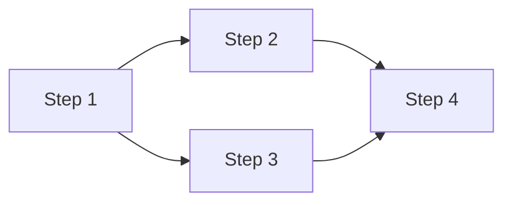

# Multi-steps plan files

A multi-steps plan is one **main plan file** plus one or more **sub-plan files**, each describing a single incremental step. The sub-plans are linked from the main plan via Obsidian **wikilinks** (`[[...]]`). Use this format when `plan-dev` is operating in **multi-steps** mode (user explicitly requested a multi-step breakdown).

## Core principle

Each step in the plan is a complete "develop → test → build" cycle. After finishing step N, the project compiles and all tests pass. This is non-negotiable — it enables incremental development where confidence grows with each step, and any collaborator (human or AI agent) can pick up from the last completed step.

## 1. File names

Main plan: `{YYYYMMDD}_{Jira}_{App}_{descriptor}.md`

Sub-plans: `{YYYYMMDD}_{Jira}_{App}_{descriptor}-STEP-{N}.md` where `N` starts at 1.

- The `{YYYYMMDD}`, `{Jira}`, `{App}`, `{descriptor}` components follow the same rules as in `single-step-plan.md` (see the sibling reference file).
- Sub-plan base names share the main plan's base; only the `-STEP-N` suffix differs.
- Example: main `20261231_PROJ-42_sample-server_introduce-event-bus.md`, sub `20261231_PROJ-42_sample-server_introduce-event-bus-STEP-1.md`.

## 2. Storage location

ALWAYS store all plan files (main + sub-plans) in `${OBSIDIAN_HOME}/00. Plans/`.

## 3. Wikilink conventions

- The main plan links to each sub-plan using Obsidian wikilinks: `[[{YYYYMMDD}_{Jira}_{App}_{descriptor}-STEP-1]]` (the `.md` extension is omitted).
- Each sub-plan links back to the main plan via wikilink in its header area.
- Wikilinks must NOT be wrapped in backticks.

## 4. Main plan content

- Frontmatter and section titles in English; body content in Korean.

```markdown
---
Application: {Application}
JiraTicket: {Jira ticket number}
PlanType: multi-steps
---

# [Project / Initiative Name]

Main plan. Sub-plans:
- [[{YYYYMMDD}_{Jira}_{App}_{descriptor}-STEP-1]]
- [[{YYYYMMDD}_{Jira}_{App}_{descriptor}-STEP-2]]
- ...

Related research:
- {wikilink or path to RESEARCH file}
- ...

## Goal
One-paragraph summary of what we're building and why.

## Architecture Overview
High-level architecture — key components, their relationships, and technology choices. Keep it concise but sufficient for someone to understand the system shape. When SPEC.md is the source, derive from its Architecture section (Context, Runtime, Code/Module).

## Tech Stack
Languages, frameworks, and key dependencies. When SPEC.md is the source, carry over from its Tech Stack section.

## Conventions
Project-wide conventions that apply across all steps — error handling, logging, API response format, auth approach, etc. When SPEC.md is the source, carry over from its Conventions section.

## Requirements Coverage
Include this section ONLY when SPEC.md with numbered Functional Requirements (FR-N) is an input. Map each FR-N to the step(s) that implement it.

| Requirement | Description | Implemented In |
|-------------|-------------|----------------|
| FR-1 | {name} | Step 2, Step 3 |
| FR-2 | {name} | Step 4 |

Every FR-N must appear in at least one step. If a requirement is intentionally deferred, note it explicitly.

## Steps Overview

| Step | Title | Description | Depends On |
|------|-------|-------------|------------|
| 1 | {title} | {one-line summary} | — |
| 2 | {title} | {one-line summary} | Step 1 |
| 3 | {title} | {one-line summary} | Step 1 |
| 4 | {title} | {one-line summary} | Step 2, 3 |

## Execution Flow

Analyze step dependencies to identify which steps can run in parallel. Present phases where each phase contains steps that can be developed concurrently.

Phase 1: [Step 1]
Phase 2: [Step 2, Step 3]  ← parallel (both depend only on Step 1)
Phase 3: [Step 4]          ← depends on Steps 2 and 3

Visualize as a Mermaid DAG:



## Sub-plans
- [[{YYYYMMDD}_{Jira}_{App}_{descriptor}-STEP-1]] — {title}
- [[{YYYYMMDD}_{Jira}_{App}_{descriptor}-STEP-2]] — {title}
- ...
```

## 5. Sub-plan content (`-STEP-N.md`)

```markdown
---
Application: {Application}
JiraTicket: {Jira ticket number}
PlanType: multi-steps-sub
Step: {N}
---

# Step {N}: {Title}

Part of main plan: [[{YYYYMMDD}_{Jira}_{App}_{descriptor}]]

## Goal
What this step achieves and why it matters in the overall plan.

## Implements
Which Functional Requirements (FR-N) from SPEC.md this step covers, fully or partially. Omit this section if SPEC.md is not an input or this step implements no specific FR (e.g., project scaffold).
- FR-1: {brief description of what aspect is implemented in this step}
- FR-3: {brief description} (partial — remaining in Step 5)

## Depends On
List prior steps that must be completed first (or "None" for the first step).

## Tasks
Checkbox list of concrete tasks — `implement-dev` ticks each box the moment the task is done. Each task specifies:
- What to do (create file, implement function, configure tool, etc.)
- Which file(s) to create or modify
- Key implementation details — enough that someone (or an AI agent) can execute without re-investigating
- Applicable conventions (remind the implementer of relevant patterns from the main plan's Conventions section)

Format:
- [ ] Task 1 — {what} in `path/to/file` ({key detail or convention})
- [ ] Task 2 — ...

## Affected Files
| Action | Path | Description |
|--------|------|-------------|
| Create | `path/to/file` | Brief purpose |
| Modify | `path/to/existing` | What changes and why |

## Tests
- What to test (unit / integration)
- Which test files to create
- Key test scenarios — derived from FR Input/Output and Business rules where applicable
- Edge cases to cover

## Build Verification
Commands to confirm this step is complete:

```bash
# Adapt to the project's tech stack:
# Go:    go build ./... && go test ./... && go vet ./...
# Node:  npm run build && npm test && npm run lint
# Rust:  cargo build && cargo test && cargo clippy
```

These commands must pass after this step is done.

## Completion Checklist
- [ ] All tasks completed
- [ ] All tests written and passing
- [ ] Build verification passes
- [ ] No regressions from previous steps
- [ ] Conventions followed (error handling, logging, API format, etc.)
```

## 6. Step decomposition guidance

- **FR-driven decomposition** (when SPEC.md is input): each FR-N already has Input, Output, Business rules, Edge cases — these map directly to a step's tasks and test scenarios. Group related FRs into a single step when they share dependencies; split a large FR across multiple steps when it's too big.
- **Incrementality**: each step must leave the project compiling and tests passing. Foundation → framing → walls, not "install all plumbing, then all electrical."
- **Right-sized steps**: a good step takes 1–4 hours of focused work. If a step has more than ~10 tasks, consider splitting it.
- **Test-first thinking**: if you cannot define clear tests for a step, the step's scope is probably wrong.
- **Common first step**: project scaffold — module/package init, directory structure, linting/formatting config, CI setup, convention infrastructure (error types, logger setup, response helpers).

Adapt the breakdown to the project's nature — TUI, backend service, CLI, library, and full-stack apps each have different natural decomposition patterns. Don't force a one-size-fits-all structure.

## 7. Cross-checks

Before finalizing:

- "If I completed only steps 1 through N, does the project compile and do all tests pass?" — If not, restructure.
- "Does every FR-N (when SPEC.md is an input) appear in at least one step's `Implements` section?" — If not, add the missing coverage.
- "Do the main plan's wikilinks point to existing sub-plan filenames?" — Verify each link.
